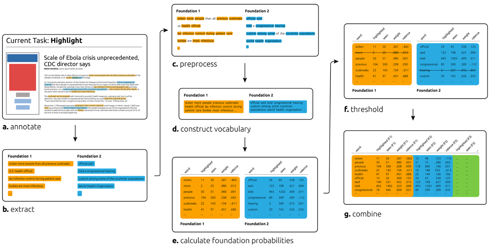

<h3 style="text-align: center">Journal Publications</h3>

_Electronic versions are provided as a professional courtesy to ensure timely dissemination of academic work for individual, noncommercial purposes. Copyright and all rights therein resides with the respective copyright holders, as stated within each paper. These files may not be reposted without permission._  

----

    Moral Reasoning in the Brain 
    
    

        <strong>Moral intuitions elicit dissociable cortical activation.</strong>
        
Moral foundations theory (MFT) holds that moral judgements are driven by modular and ideologically variable moral foundations but where and how these foundations are represented in the brain and shaped by political beliefs remains an open question. Using a moral vignette judgement task (n=64), we probed the neural (dis)unity of moral foundations. Univariate analyses revealed that moral judgement of moral foundations, versus conventional norms, reliably recruits core areas implicated in theory of mind. Yet, multivariate pattern analysis demonstrated that each moral foundation elicits dissociable neural representations distributed throughout the cortex. As predicted by MFT, individuals’ liberal or conservative orientation modulated neural responses to moral foundations. Our results confirm that each moral foundation recruits domain-general mechanisms of social cognition but also has a dissociable neural signature malleable by sociomoral experience. We discuss these findings in view of unified versus dissociable accounts of morality and their neurological support for MFT.

    

    

        
 
            • <strong>Moral Reasoning in the Brain</strong>, Amir, O., Fisher, J.T., Grafton, S., Sinnott-Armstrong, W., & Weber, R. (2023).
            Moral foundations elicit shared and dissociable cortical activation modulated by political
            ideology. <em>Nature Human Behavior</em>. 
            <a href="https://t.co/nlAQSwNI23"><strong>[PDF]</strong></a>
            <a href="https://assets.researchsquare.com/files/rs-2133317/v1/352315f4-2fe3-4602-85f7-52b04eac26c9.pdf?c=1666114974"><strong>[Preprint]</strong></a>
            <a href="https://github.com/medianeuroscience/mft_vignettes"><strong>[Code]</strong></a>
        

        

            • Mokhberian, N., <strong>Hopp, F.R.</strong>, Harandizadeh, B., Morstatter F., & Lerman, K. (2022). 
            Noise audits improve moral foundation classification. <em>IEEE/ACM International Conference on Social Networks Analysis and Mining</em>. 
            <a href="https://arxiv.org/pdf/2210.07415"><strong>[Preprint]</strong></a>
        

    

    

• **Hopp, F.R.**, & Weber, R. (2021). Reflections on extracting moral foundations from media content. _Communication Monographs_.

• **Hopp, F.R.**, & Weber, R. (2021). Rejoinder: How methodological decisions impact the validity of moral content analyses. _Communication Monographs_.

• Malik, M., **Hopp, F.R.**, Chen, Y., & Weber, R. (2021). Does regional variation in pathogen prevalence predict the moralization of COVID-19 in online news? _Journal of Language and Social Psychology_. [**[PDF]**](https://journals.sagepub.com/doi/pdf/10.1177/0261927X211044194)

• **Hopp, F.R.**, Fisher, J., & Weber, R. (2020). A graph-learning approach for detecting moral conflict in movie scripts. _Media and Communication_. [**[PDF]**](https://www.cogitatiopress.com/mediaandcommunication/article/view/3155)

    

        
    

    

    	
 • <strong>Hopp, F.R.</strong>, Fisher, J., Cornell, D., Huskey, R., & Weber, R. (2020).
    The extended moral foundations dictionary (eMFD): Development and applications of a crowd-sourced approach to extracting moral intuitions from text.
    <em>Behavior Research Methods</em>. 
    <a href="https://psyarxiv.com/924gq/download?format=pdf"><strong>[PDF]</strong></a>
    	

    

    • Mokhberian, N., <strong>Hopp, F.R.</strong>, Harandizadeh, B., Morstatter F., & Lerman, K. (2022). 
    Noise audits improve moral foundation classification. <em>IEEE/ACM International Conference on Social Networks Analysis and Mining</em>. 
    <a href="https://arxiv.org/pdf/2210.07415"><strong>[Preprint]</strong></a>
	

	

    • <strong>Hopp, F.R.</strong>, & Weber, R. (2021). 
    Reflections on extracting moral foundations from media content. <em>Communication Monographs</em>.
	

    

• **Hopp, F.R**., Fisher, J. T., & Weber, R. (2020). Dynamic transactions between news frames and sociopolitical events: An integrative, hidden markov model approach. _Journal of Communication_. [**[PDF]**](https://www.jacobtfisher.com/assets/files/HMM_postprint.pdf)

• Weber, R., & **Hopp, F.R.** (2020). Moral emotions and conflict motivate actions. _Insights – Consumer Neuroscience in Business_. [**[PDF]**](https://fhopp.github.io/publications/moral_conflict.pdf) 

• **Hopp, F.R.**, Schaffer, J., Fisher, J. T., & Weber, R. (2019). iCoRe: The GDELT interface for the advancement of communication research. _Computational Communication Research_. [**[PDF]**](https://computationalcommunication.org/index.php/ccr/announcement/view/1)

• Weber, R., Mangus, J. M., Huskey, R., **Hopp, F. R.**, Amir, O., Swanson, R., ... & Tamborini, R. (2018). Extracting latent moral information from text narratives: Relevance, challenges, and solutions. _Communication Methods and Measures_. [**[PDF]**](https://fhopp.github.io/publications/weber2018.pdf)

<i></i>   Secondary Research 

• Fisher, J.T., **Hopp, F.R.**, & Weber, R. (2023). Cognitive and perceptual load have opposing
effects on brain network efficiency and behavioural variability in ADHD. _Network Neuroscience_. [**[PDF]**](https://direct.mit.edu/netn/article/doi/10.1162/netn_a_00336/117485/Cognitive-and-Perceptual-Load-Have-Opposing)

• Youk, S., Malik, M., Chen, Y., **Hopp, F.R.**, & Weber, R. (in press). Measures of argument strength: A computational, large-scale analysis of effective persuasion in real-world debates. _Communication Methods and Measures_. 

• Fisher, J.T., **Hopp, F.R.**, Chen, Y., & Weber, R. (2023). Uncovering the structure of media
multitasking using network analytic techniques. _Computers in Human Behavior_. [**[Preprint]**](https://osf.io/upez3/download)

• Schneider, F.M., Rieger, D., **Hopp, F.R.**, (2023). First aid in the pocket: the psychosocial benefits
of smartphones in self-threatening situations. _Computers in Human Behavior_. [**[Preprint]**](https://psyarxiv.com/z4psm/download)

• Fisher, J.T., **Hopp, F.R.**, & Weber, R. (2022). Mapping attention across multiple media tasks. _Media Psychology_. [**[Preprint]**](https://mediarxiv.org/txfka/download) 

• Chen, Y., **Hopp, F.R.**, Malik, M., Wang, P. T., Woodman, K., Youk, S., & Weber, R. (2022) Reproducing FSL's fMRI Data Analysis via Nipype: Relevance, Challenges, and Solutions. _Frontiers in Neuroimaging_. [PDF](https://www.frontiersin.org/articles/10.3389/fnimg.2022.953215/full)

• Malik, M., **Hopp, F.R.**, & Weber, R. (2022). Representations of racial minorities in popular movies: A content-analytic synergy of computer vision and network science. _Computational Communication Research_. [**[PDF]**](https://computationalcommunication.org/ccr/article/download/106/45)

• Rohm, S., **Hopp, F.R.**, & Smit, E. (2021). Exposure to serial audiovisual narratives increases empathy via vicarious interactions _Media Psychology_. [**[PDF]**](https://www.tandfonline.com/doi/full/10.1080/15213269.2021.1879654?src=)

• Fisher, J., **Hopp, F.R.**, & Weber, R. (2020). A practical introduction to network neuroscience for communication researchers. _Communication Methods and Measures_. [**[PDF]**](https://osf.io/4txuf/download?format=pdf)

• Fisher, J. T., **Hopp, F. R**., & Weber, R. (2019). Modality-specific effects of perceptual load in multimedia processing. _Media and Communication_. [**[PDF]**](https://www.cogitatiopress.com/mediaandcommunication/article/download/2388/2388)

• Weber, R., Fisher, J. T., **Hopp, F. R.**, & Lonergan, C. (2018). Taking messages into the magnet: Method–theory synergy in communication neuroscience. _Communication Monographs_. [**[PDF]**](https://fhopp.github.io/publications/weber2017.pdf)

• Weinmann, C., Roth, F. S., Schneider, F. M., Krämer, T., **Hopp, F. R.**, Bindl, M. J., & Vorderer, P. (2017). “I don’t care about politics, I just like that guy!” Affective disposition and political attributes in information processing of political talk shows. _International Journal of Communication_. [**[PDF]**](https://fhopp.github.io/publications/weinmann2017.pdf)

• Schneider, F. M., Zwillich, B., Bindl, M. J., **Hopp, F. R.**, Reich, S., & Vorderer, P. (2017). Social media ostracism: The effects of being excluded online. _Computers in Human Behavior_. [**[PDF]**](https://fhopp.github.io/publications/schneider2017.pdf)

• Roth, F. S., Weinmann, C., Schneider, F. M., **Hopp, F. R.**, Bindl, M. J., & Vorderer, P. (2017). Curving entertainment: The curvilinear relationship between hedonic and eudaimonic entertainment experiences while watching a political talk show and its implications for information processing. _Psychology of Popular Media Culture_. [**[PDF]**](https://fhopp.github.io/publications/roth2017.pdf)

• Roth, F. S., Weinmann, C., Schneider, F. M., **Hopp, F. R.**, & Vorderer, P. (2014). Seriously entertained: Antecedents and consequences of hedonic and eudaimonic entertainment experiences with political talk shows on TV. _Mass Communication and Society_. [**[PDF]**](https://fhopp.github.io/publications/roth2014.pdf)

