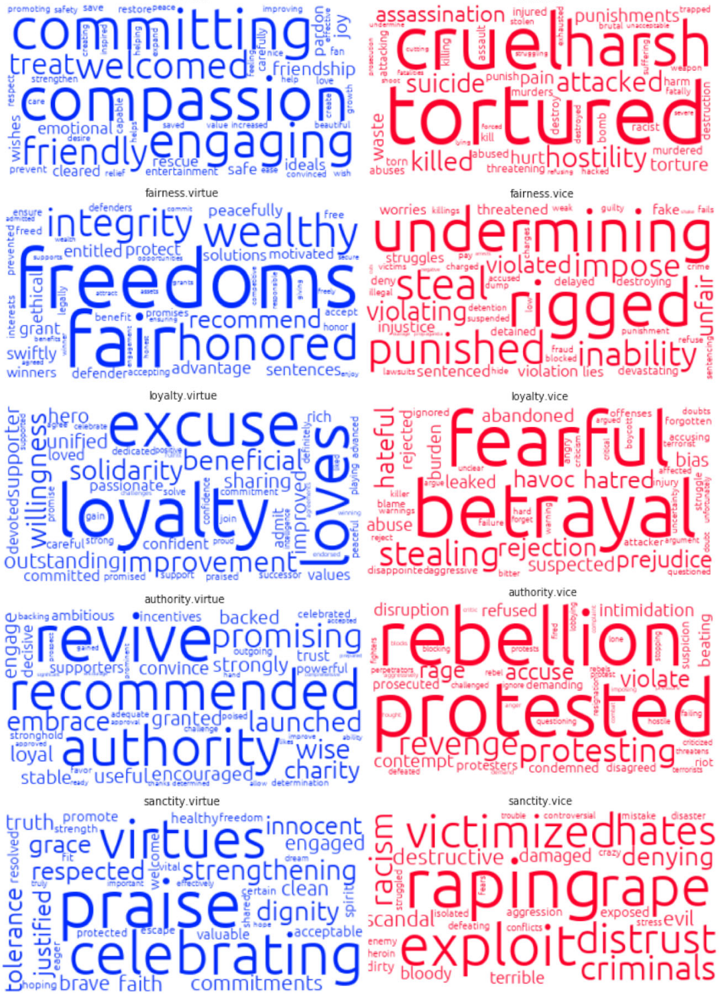

<h3 style="text-align: center">Journal Publications</h3>

_Electronic versions are provided as a professional courtesy to ensure timely dissemination of academic work for individual, noncommercial purposes. Copyright and all rights therein resides with the respective copyright holders, as stated within each paper. These files may not be reposted without permission._  

----

<i></i>   Primary Research 

<a href="https://www.nature.com/articles/s41562-023-01693-8" target="_blank" style="color: black; text-decoration: underline; font-weight: bold">Moral Reasoning in the Brain</a>

<strong>Moral Foundations Elicit Shared and Dissociable Cortical Activation</strong> Moral foundations theory posits that there are five or six universal groups of moral intuitions (that is, ‘foundations’), each of which is served by functionally specialized, dissociable cognitive mechanisms. We probed the neural (dis)unity of moral foundations theory and report that each moral foundation recruits domain-general mechanisms of social cognition, but also has a dissociable neural signature that is malleable by sociomoral experience.  • <strong>Hopp, F. R.</strong>, Amir, O., Fisher, J. T., Grafton, S., Sinnott-Armstrong, W., & Weber, R. (2023). Moral foundations elicit shared and dissociable cortical activation modulated by political ideology. <em>Nature Human Behaviour</em>. 

<a href="https://link.springer.com/article/10.3758/s13428-020-01433-0" target="_blank" style="color: black; text-decoration: underline; font-weight: bold">The extended Moral Foundations Dictionary (eMFD)</a>

<strong>Crowdsourcing Moral Sentiment</strong> Extracting and analyzing moral content in messages, narratives, and other forms of public discourse is a critical step toward understanding how the psychological influence of moral judgments unfolds at a global scale. We introduce the extended Moral Foundations Dictionary (eMFD), a tool for extracting moral content from textual corpora. The eMFD, unlike previous methods, is constructed from text annotations generated by a large sample of human coders. The eMFD was featured by the <a href="https://featuredcontent.psychonomic.org/the-extended-moral-foundations-dictionary-a-new-resource-for-coding-moral-content/" target="_blank">Psychonomic Society</a>.   • <strong>Hopp, F. R.</strong>, Fisher, J. T., Cornell, D., Huskey, R., & Weber, R. (2021). The extended Moral Foundations Dictionary (eMFD): Development and applications of a crowd-sourced approach to extracting moral intuitions from text. <em>Behavior Research Methods</em>.

<a href="https://www.tandfonline.com/doi/full/10.1080/03637751.2021.1963513?casa_token=q42-8Fof3igAAAAA%3A1v325DJlsgDJvaRHPdxZpkPevRf7PxNFgjk1ZTiKPTQVs1a6VMef05RF4kJu4KFxgMgxcGi5PXqN" target="_blank" style="color: black; text-decoration: underline; font-weight: bold">Reflections on Extracting Morality from Texts</a>

<strong>How Methodological Decisions Impact Moral Content Analyses</strong> The valid extraction of moral information from media content is a critical step toward understanding the dynamic transactions between moral frames and real-world events. In two review articles, we provide a commentary on recent approaches and procedures. • <strong>Hopp, F. R.</strong>, & Weber, R. (2021). Reflections on extracting moral foundations from media content. <em>Communication Monographs.</em> • <strong>Hopp, F. R.</strong>, & Weber, R. (2021). Rejoinder: How methodological decisions impact the validity of moral content analyses. <em>Communication Monographs</em>.

<a href="https://academic.oup.com/joc/article/70/3/335/5855533" target="_blank" style="color: black; text-decoration: underline; font-weight: bold">Dynamic Transactions Between Moralized News and Events</a>

<strong>A Hidden Markov Model Approach</strong> We present a macro-scale investigation of the dynamic transactions between moralized news and events using Hidden Markov Models (HMMs). Using 3,501,141 news records discussing 504,759 unique events, we demonstrate that sequences of news and events can be characterized in terms of “hidden states” containing distinct moral frames and event relationships, and that these “hidden states” can forecast future news frames and events.. • <strong>Hopp, F. R.</strong>, Fisher, J. T., & Weber, R. (2020). Dynamic transactions between news frames and sociopolitical events: an integrative, hidden Markov model approach. <em>Journal of Communication</em>.

<a href="https://www.cogitatiopress.com/mediaandcommunication/article/view/3155/3155" target="_blank" style="color: black; text-decoration: underline; font-weight: bold">Detecting Moral Conflicts in Movie Scripts</a>

<strong>A Graph-Learning NLP Approach</strong>  Moral conflict is central to appealing narratives, but no methodology exists for computationally extracting moral conflict from narratives at scale. We combine tools from social network analysis and natural language processing to detect and classify moral conflicts across 894 movie scripts encompassing 82,195 scenes. We show that scenes containing moral conflict between central characters can be identified using changes in connectivity patterns between character network modules. We also derive computational models for standardizing moral conflict measurements. Our results suggest that this method can accurately extract moral conflict from a diverse collection of movie scripts. • <strong>Hopp, F. R.</strong>, Fisher, J. T., & Weber, R. (2020). A Graph-Learning Approach for Detecting Moral Conflict in Movie Scripts. <em>Media & Communication</em>.

• Malik, M., **Hopp, F.R.**, Chen, Y., & Weber, R. (2021). Does regional variation in pathogen prevalence predict the moralization of COVID-19 in online news? _Journal of Language and Social Psychology_. [**[PDF]**](https://journals.sagepub.com/doi/pdf/10.1177/0261927X211044194)

• **Hopp, F.R**., Fisher, J. T., & Weber, R. (2020). Dynamic transactions between news frames and sociopolitical events: An integrative, hidden markov model approach. _Journal of Communication_. [**[PDF]**](https://www.jacobtfisher.com/assets/files/HMM_postprint.pdf)

• **Hopp, F.R.**, Schaffer, J., Fisher, J. T., & Weber, R. (2019). iCoRe: The GDELT interface for the advancement of communication research. _Computational Communication Research_. [**[PDF]**](https://computationalcommunication.org/index.php/ccr/announcement/view/1)

• Weber, R., Mangus, J. M., Huskey, R., **Hopp, F. R.**, Amir, O., Swanson, R., ... & Tamborini, R. (2018). Extracting latent moral information from text narratives: Relevance, challenges, and solutions. _Communication Methods and Measures_. [**[PDF]**](https://fhopp.github.io/publications/weber2018.pdf)

<i></i>   Secondary Research 

• Fisher, J.T., **Hopp, F.R.**, & Weber, R. (2023). Cognitive and perceptual load have opposing
effects on brain network efficiency and behavioural variability in ADHD. _Network Neuroscience_. [**[PDF]**](https://direct.mit.edu/netn/article/doi/10.1162/netn_a_00336/117485/Cognitive-and-Perceptual-Load-Have-Opposing)

• Youk, S., Malik, M., Chen, Y., **Hopp, F.R.**, & Weber, R. (in press). Measures of argument strength: A computational, large-scale analysis of effective persuasion in real-world debates. _Communication Methods and Measures_. 

• Fisher, J.T., **Hopp, F.R.**, Chen, Y., & Weber, R. (2023). Uncovering the structure of media
multitasking using network analytic techniques. _Computers in Human Behavior_. [**[Preprint]**](https://osf.io/upez3/download)

• Schneider, F.M., Rieger, D., **Hopp, F.R.**, (2023). First aid in the pocket: the psychosocial benefits
of smartphones in self-threatening situations. _Computers in Human Behavior_. [**[Preprint]**](https://psyarxiv.com/z4psm/download)

• Fisher, J.T., **Hopp, F.R.**, & Weber, R. (2022). Mapping attention across multiple media tasks. _Media Psychology_. [**[Preprint]**](https://mediarxiv.org/txfka/download) 

• Chen, Y., **Hopp, F.R.**, Malik, M., Wang, P. T., Woodman, K., Youk, S., & Weber, R. (2022) Reproducing FSL's fMRI Data Analysis via Nipype: Relevance, Challenges, and Solutions. _Frontiers in Neuroimaging_. [PDF](https://www.frontiersin.org/articles/10.3389/fnimg.2022.953215/full)

• Malik, M., **Hopp, F.R.**, & Weber, R. (2022). Representations of racial minorities in popular movies: A content-analytic synergy of computer vision and network science. _Computational Communication Research_. [**[PDF]**](https://computationalcommunication.org/ccr/article/download/106/45)

• Rohm, S., **Hopp, F.R.**, & Smit, E. (2021). Exposure to serial audiovisual narratives increases empathy via vicarious interactions _Media Psychology_. [**[PDF]**](https://www.tandfonline.com/doi/full/10.1080/15213269.2021.1879654?src=)

• Fisher, J., **Hopp, F.R.**, & Weber, R. (2020). A practical introduction to network neuroscience for communication researchers. _Communication Methods and Measures_. [**[PDF]**](https://osf.io/4txuf/download?format=pdf)

• Fisher, J. T., **Hopp, F. R**., & Weber, R. (2019). Modality-specific effects of perceptual load in multimedia processing. _Media and Communication_. [**[PDF]**](https://www.cogitatiopress.com/mediaandcommunication/article/download/2388/2388)

• Weber, R., Fisher, J. T., **Hopp, F. R.**, & Lonergan, C. (2018). Taking messages into the magnet: Method–theory synergy in communication neuroscience. _Communication Monographs_. [**[PDF]**](https://fhopp.github.io/publications/weber2017.pdf)

• Weinmann, C., Roth, F. S., Schneider, F. M., Krämer, T., **Hopp, F. R.**, Bindl, M. J., & Vorderer, P. (2017). “I don’t care about politics, I just like that guy!” Affective disposition and political attributes in information processing of political talk shows. _International Journal of Communication_. [**[PDF]**](https://fhopp.github.io/publications/weinmann2017.pdf)

• Schneider, F. M., Zwillich, B., Bindl, M. J., **Hopp, F. R.**, Reich, S., & Vorderer, P. (2017). Social media ostracism: The effects of being excluded online. _Computers in Human Behavior_. [**[PDF]**](https://fhopp.github.io/publications/schneider2017.pdf)

• Roth, F. S., Weinmann, C., Schneider, F. M., **Hopp, F. R.**, Bindl, M. J., & Vorderer, P. (2017). Curving entertainment: The curvilinear relationship between hedonic and eudaimonic entertainment experiences while watching a political talk show and its implications for information processing. _Psychology of Popular Media Culture_. [**[PDF]**](https://fhopp.github.io/publications/roth2017.pdf)

• Roth, F. S., Weinmann, C., Schneider, F. M., **Hopp, F. R.**, & Vorderer, P. (2014). Seriously entertained: Antecedents and consequences of hedonic and eudaimonic entertainment experiences with political talk shows on TV. _Mass Communication and Society_. [**[PDF]**](https://fhopp.github.io/publications/roth2014.pdf)

