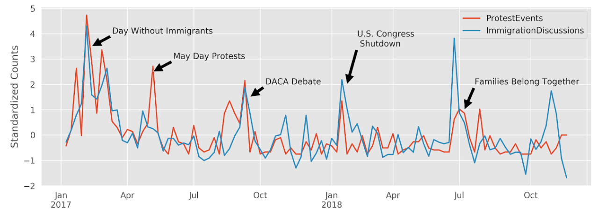
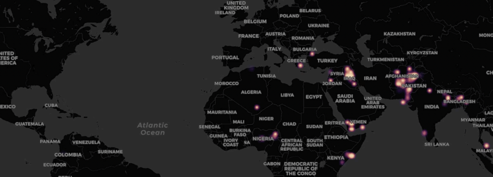

## Narratives and Morality

#### Extracting Latent Moral Information from Text Narratives  
My main research centres around the question of how morally-relevant arguments – societal prescriptions for morally right or wrong behaviors – can be extracted from media content. Moral Foundations Theory (MFT) and the Model of Intuitive Morality and Exemplars (MIME) contend that moral judgments are built on a universal set of basic moral intuitions. A large body of research has supported many of MFT’s and the MIME’s central hypotheses. Yet, an important prerequisite of this research—the ability to extract latent moral content represented in media stimuli with a reliable procedure—has not been systematically studied. In this article, we subject different extraction procedures to rigorous tests, underscore challenges by identifying a range of reliabilities, develop new reliability test and coding procedures employing computational methods, and provide solutions that maximize the reliability and validity of moral intuition extraction. In six content analytical studies, including a large crowd-based study, we demonstrate that: (1) traditional content analytical approaches lead to rather low reliabilities; (2) variation in coding reliabilities can be predicted by both text features and characteristics of the human coders; and (3) reliability is largely unaffected by the detail of coder training.We show that a coding task with simplified training and a coding technique that treats moral foundations as fast, spontaneous intuitions leads to acceptable inter-rater agreement, and potentially to more valid moral intui-tion extractions. While this study was motivated by issues related to MFTand MIME research, the methods and findings in this study have implica-tions for extracting latent content from text narratives that go beyondmoral information. Accordingly, we provide a tool for researchers interested in applying this new approach in their own work.

<i class="fa fa-book-open" style="font-size:25px"></i> Study Link 

#### The Extended Moral Foundations Dictionary (eMFD)
Moral intuitions are a central motivator in human behavior. Recent work highlights the importance of moral intuitions for understanding a wide range of issues ranging from online radicalization to vaccine hesitancy. Extracting and analyzing moral content in messages, narratives, and other forms of public discourse is a critical step toward understanding how the psychological influence of moral judgments unfolds at a global scale. Extant approaches for extracting moral content are limited in their ability to capture the intuitive nature of moral sensibilities, constraining their usefulness for understanding and predicting human moral behavior. Here we introduce the extended Moral Foundations Dictionary (eMFD), a dictionary-based tool for extracting moral content from textual corpora. The eMFD, unlike previous methods, is constructed from text annotations generated by a large sample of human coders. We demonstrate that the eMFD outperforms existing approaches in a variety of domains. We anticipate that the eMFD will contribute to advance the study of moral intuitions and their influence on social, psychological, and communicative processes.

<i class="fa fa-book-open" style="font-size:25px"></i> Study Link 

<i class="fa fa-unlock" style="font-size:25px"></i> Pre-print Link 

<i class="fa fa-database" style="font-size:25px"></i> Supplemental Materials 

#### Detecting Moral Conflicts in Movie Scripts
 Moral conflict is central to appealing narratives, and frequently foments socially-relevant outcomes, including group polarization and moral outrage. Yet, no methodology exists for computationally extracting moral conflict from messages and narratives at scale. To fill this gap, we developed an [approach](https://www.cogitatiopress.com/mediaandcommunication/article/view/3155) combining tools from social network analysis and natural language processing with recent theoretical advancements in the Model of Intuitive Morality and Exemplars. This approach considers narratives in terms of a network of dynamically evolving relationships between characters. We apply this method in order to analyze 894 movie scripts encompassing 82,195 scenes, showing that scenes containing moral conflict between central characters can be identified using changes in connectivity patterns between network modules. Furthermore, we derive computational models for standardizing moral conflict measurements. Our results suggest that this method can accurately extract moral conflict from a diverse collection of movie scripts. We provide a theoretical integration of our method into the larger milieu of storytelling and entertainment research, illuminating future research trajectories at the intersection of computational communication research and media psychology.

## News-Event Dynamics 

The main goal of this line of research is to examine the dynamic relationship between real-world events (e.g., protest movements, terror attacks, elections, etc.) and the news frames that accompany these events. Traditionally, communication research has invested great efforts in understanding how certain types of events are framed and how these frames are processed by audiences. Likewise, data-driven approaches towards event forecasting have aimed to construct stochastic models that predict event likelihoods based on preceding event sequences.

In turn, my research in this area combines both news framing and computational modeling to disentangle the relationship between news frames and events. For example, which news frames are more likely to drive subsequent news frame sequences? Which news frames are more likely to increase the probability of observing certain event types in the future and vice versa, which events precede certain densities of news frames?

Figure 1.
*Time Series of Immigration Protest Events and News Articles Discussing Immigration in the United States*

 

#### The GDELT Interface for Communication Research (iCoRe)

In order to examine these questions, I harness the Global Database of Events, Language, and Tone [GDELT](https://www.gdeltproject.org/), a massive, constantly updated database of automatically content-analyzed news stories. For an accessible introduction to GDELT, please see our recent [publication](http://www.computationalcommunication.org/index.php/ccr/article/download/27/2).

Figure 2.
*iCoRe: The GDELT Interface for Communication Research*

 

#### Dynamic Transactions Between News Frames and Real-World Events: A Hidden Markov Model Approach
To model the dynamic relationships between news frames and event densities, I rely on Hidden Markov Models (HMM). HMMs are a form of stochastic sequence models (comparable to finite-state machines) that allow to classify noisy sequences of observations into discrete states. By learning the stochastic dependency among these observations, HMMs can be harnessed to (a) better understand the co-occurence of news frames and event types and (b) allow to sample observations for news-event forecasting.

In a recent [paper](https://www.jacobtfisher.com/assets/files/HMM_postprint.pdf), we demonstrated   that   sequences   of   frames   and   events   can   be characterized in terms of "hidden states" containing distinct moral frame and event relationships, and that these  “hidden  states”  can  forecast  future  news  frames  and  events.  This  work  serves  to  construct  a  path toward the integrated study of the news-event cycle across multiple research domain.

Figure 3.
*Heatmap of Global Terror Events*

