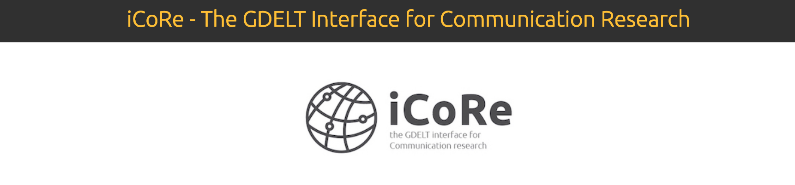

## Narratives and Morality

#### Extracting Latent Moral Information from Text Narratives 
My main research centres around the question of how morally-relevant arguments – societal prescriptions for morally right or wrong behaviors – can be extracted from media content. 
In a [series of content-analytic studies](https://fhopp.github.io/publications/weber2018.pdf), we showed that a large-crowd of minimally trained coders can outperform trained expert coders when annotating morally-relevant content cues in news narratives. Furthermore, we highlighted that disagreement among coders frequently presents signal (rather than noise), when coders' variable moral sensitivities are taken into account. 

#### The Extended Moral Foundations Dictionary (eMFD)
Based on the above coding framework, my colleagues and I harnessed over 60,000 content annotations to develop an [extended Moral Foundations Dictionary (eMFD)](https://psyarxiv.com/924gq/download?format=pdf) for the automated extraction of morally-relevant cues from large textual corpora. Across various theory-driven validation studies, we show that the eMFD outperforms previous approaches for extracting moral information from text and suggest novel directions for studying human morality in the wild. 

#### Detecting Moral Conflicts in Movie Scripts
 Moral conflict is central to appealing narratives, and frequently foments socially-relevant outcomes, including group polarization and moral outrage. Yet, no methodology exists for computationally extracting moral conflict from messages and narratives at scale. To fill this gap, we developed an [approach](https://www.cogitatiopress.com/mediaandcommunication/article/view/3155) combining tools from social network analysis and natural language processing with recent theoretical advancements in the Model of Intuitive Morality and Exemplars. This approach considers narratives in terms of a network of dynamically evolving relationships between characters. We apply this method in order to analyze 894 movie scripts encompassing 82,195 scenes, showing that scenes containing moral conflict between central characters can be identified using changes in connectivity patterns between network modules. Furthermore, we derive computational models for standardizing moral conflict measurements. Our results suggest that this method can accurately extract moral conflict from a diverse collection of movie scripts. We provide a theoretical integration of our method into the larger milieu of storytelling and entertainment research, illuminating future research trajectories at the intersection of computational communication research and media psychology.

---

## Global News Analysis and Event Prediction 

The main goal of this line of research is to examine the dynamic relationship between real-world events (e.g., protest movements, terror attacks, elections, etc.) and the news frames that accompany these events. Traditionally, communication research has invested great efforts in understanding how certain types of events are framed and how these frames are processed by audiences. Likewise, data-driven approaches towards event forecasting have aimed to construct stochastic models that predict event likelihoods based on preceding event sequences.

In turn, my research in this area combines both news framing and computational modeling to disentangle the relationship between news frames and events. For example, which news frames are more likely to drive subsequent news frame sequences? Which news frames are more likely to increase the probability of observing certain event types in the future and vice versa, which events precede certain densities of news frames?

Figure 1.
*Time Series of Immigration Protest Events and News Articles Discussing Immigration in the United States*

 

#### The GDELT Interface for Communication Research (iCoRe)

In order to examine these questions, I harness the Global Database of Events, Language, and Tone [GDELT](https://www.gdeltproject.org/), a massive, constantly updated database of automatically content-analyzed news stories. For an accessible introduction to GDELT, please see our recent [publication](http://www.computationalcommunication.org/index.php/ccr/article/download/27/2).

Figure 2.
*iCoRe: The GDELT Interface for Communication Research*

 

#### Dynamic Transactions Between News Frames and Real-World Events: A Hidden Markov Model Approach
To model the dynamic relationships between news frames and event densities, I rely on Hidden Markov Models (HMM). HMMs are a form of stochastic sequence models (comparable to finite-state machines) that allow to classify noisy sequences of observations into discrete states. By learning the stochastic dependency among these observations, HMMs can be harnessed to (a) better understand the co-occurence of news frames and event types and (b) allow to sample observations for news-event forecasting.

In a recent [paper](https://www.jacobtfisher.com/assets/files/HMM_postprint.pdf), we demonstrated   that   sequences   of   frames   and   events   can   be characterized in terms of "hidden states" containing distinct moral frame and event relationships, and that these  “hidden  states”  can  forecast  future  news  frames  and  events.  This  work  serves  to  construct  a  path toward the integrated study of the news-event cycle across multiple research domain.

Figure 3.
*Heatmap of Global Terror Events*

